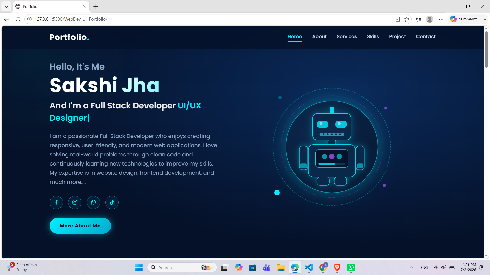

# 💼 Personal Portfolio Website

## 📖 Overview

This project is a responsive personal portfolio website developed to showcase my technical skills, projects, education, and contact information. The portfolio serves as my digital resume and reflects my front-end development abilities through a clean and modern design.

## 📸 Preview



## ✨ Features

- Responsive Hero Section
- About Me
- Skills Section
- Projects Showcase
- Contact Section
- Smooth Navigation
- Social Media Links
- Modern UI Design

## 🛠️ Technologies Used

- HTML5
- CSS3
- JavaScript

## 📁 Project Structure

```
WebDev-L1-Portfolio
│── index.html
│── stylesheet.css
│── main.js
│── assets/
│── screenshot.png
└── README.md
```

## 🚀 How to Run

1. Clone or download the repository.
2. Open the folder.
3. Run **index.html** using your browser or Live Server.

## 🎯 Learning Outcomes

- Portfolio Design
- Responsive Web Design
- HTML Structure
- CSS Styling
- JavaScript Interactivity

## 👩‍💻 Author

**Sakshi Jha**

---

Developed as part of the **Oasis Infobyte Web Development & Designing Internship (Level 1)**.
